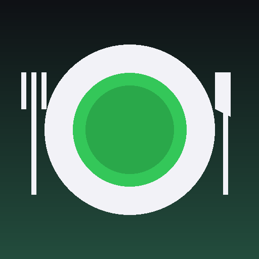

# Меню недели 🍽

Небольшое PWA для планирования питания на двоих: меню на неделю, общий список покупок с синхронизацией между двумя айфонами и КБЖУ по дням. Без бэкенда и без платных сервисов.

<p align="center">
  
</p>

## Что умеет

- **Меню** — расписание блюд по дням (завтрак / обед / перекус / ужин), КБЖУ каждой порции, отметки «готовим ×4 порции» и «доедаем вчерашнее». Сегодняшний день подсвечен.
- **Покупки** — единый список на неделю по категориям с прогрессом. Отметки «куплено» синхронизируются между устройствами.
- **КБЖУ** — сумма по каждому дню против личных целей каждого из вас, с цветными шкалами.
- **Офлайн** — добавляется на домашний экран как приложение и открывается без интернета (последний загруженный план сохраняется).

## Приватность

В этом публичном репозитории — **только код приложения**. Никаких ваших данных здесь нет:

- Меню, КБЖУ и отметки «куплено» хранятся в **Google Drive** и доступны только через секретный ключ, который знаете вы двое.
- Файл `plan.example.json` — это лишь пример формата, не рабочие данные.

## Как пользоваться

### Первый запуск на айфоне (2 минуты)

1. Откройте ссылку приложения в **Safari**.
2. «Поделиться» → **«На экран „Домой"»**.
3. Запустите с домашнего экрана → нажмите ⚙️ → вставьте **URL скрипта** и **секретный ключ** → «Сохранить».

URL и ключ вам даст тот, кто настраивал приложение (в одно сообщение / AirDrop). Больше ничего вводить не нужно — доступ к Google Drive не требуется.

### Каждую неделю

Новый план недели генерируется в чате с Claude (идеи меню → готовый JSON) и загружается один раз:

⚙️ → поле **«Импорт плана недели»** → вставить JSON → «Загрузить план».

Через секунду новая неделя появляется у обоих. Отдельно нажимать «Обновить» не нужно — приложение подтягивает свежие данные при каждом открытии.

## Для дизайнера 🎨

Весь внешний вид собран в начале файла [index.html](index.html) — блок `:root { … }`: цвета, скругления, фон, тёмная тема. Каждая переменная подписана комментарием.

Менять можно прямо на github.com: откройте `index.html`, нажмите ✏️, поправьте значения и закоммитьте. Через минуту изменения приедут на телефон (переоткройте приложение). Сломать не страшно — git хранит всю историю, любой коммит откатывается.

## Формат плана

Пример — в [plan.example.json](plan.example.json). Кратко:

```json
{
  "title": "Неделя 6–12 июля",
  "targets": {
    "Илья": { "kcal": 2600, "p": 170, "f": 85, "c": 290 },
    "Жена": { "kcal": 1900, "p": 120, "f": 65, "c": 210 }
  },
  "days": [{
    "date": "2026-07-06", "name": "Понедельник",
    "meals": [{
      "slot": "Ужин", "name": "Лосось с булгуром",
      "cook": true,          // готовим ×4 порции
      "leftover": false,     // доедаем вчерашнее
      "note": "необязательный комментарий",
      "kbju": { "kcal": 620, "p": 40, "f": 24, "c": 58 }  // на 1 порцию
    }]
  }],
  "shopping": [
    { "cat": "Мясо и рыба", "items": [{ "n": "Лосось", "q": "600 г" }] }
  ]
}
```

- `p` / `f` / `c` — белки / жиры / углеводы (граммы).
- `cook: true` — блюдо готовится на ×4 порции (двое × два раза).
- `leftover: true` — сегодня доедаем приготовленное накануне.

## Как это устроено

- [index.html](index.html) — всё приложение одним файлом (HTML + CSS + JS), хостится на GitHub Pages.
- [sw.js](sw.js) — service worker для офлайн-режима.
- [manifest.webmanifest](manifest.webmanifest) — манифест PWA (иконки, имя, тема).
- Данные (`plan.json` и `checks.json`) живут в Google Drive и отдаются через Google Apps Script — тонкий мост между приложением и Drive.

Синхронизация отметок — last-write-wins с задержкой около секунды; для двоих этого достаточно. Квоты Apps Script (20 000 вызовов в день) для двух человек недостижимы.
